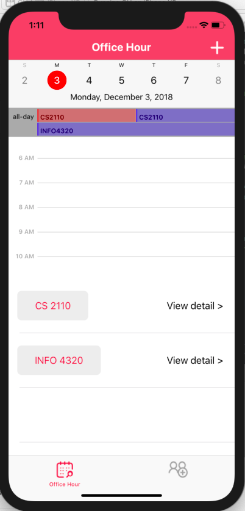
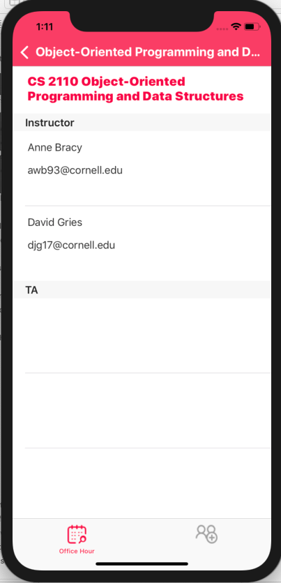
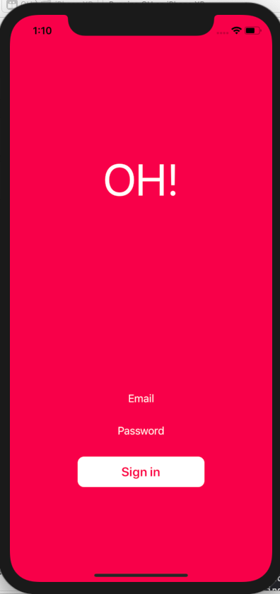
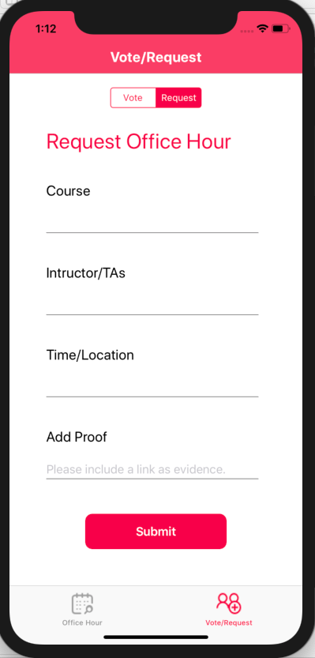
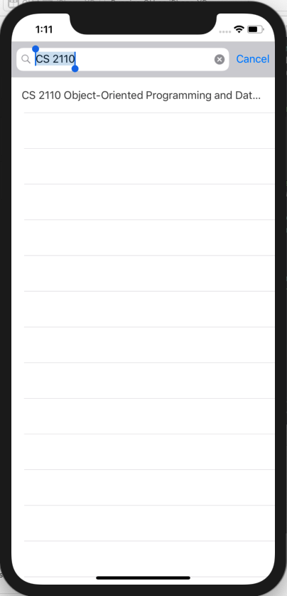
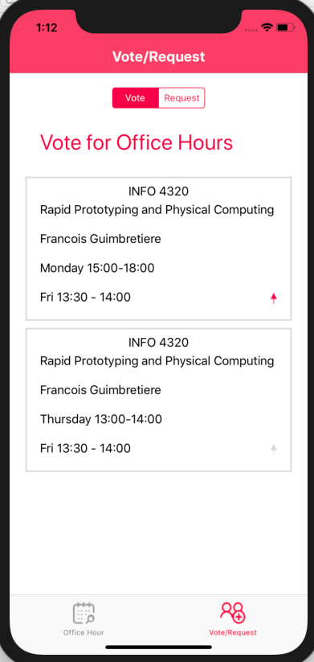

EasyMeet
Li Chai, Priyanka Dilip, Qi Zhang, Joie Ng
# OH!

## App Tagline:
Our app aims to create a platform that integrates office hours at Cornell and facilitates the process of connecting students and professors.

### Link(s) to any other public GitHub repo(s) of your app. If you have one repo for iOS and one for Backend, please link to your backend repo in your iOS README, and your iOS repo in your backend README.

https://github.com/joiewyng/OfficeHours
https://github.com/PriyankaDilip/class-connect-backend

### Some screenshots of your app (highlight important features)

### A short description of your app (its purpose and features)
The goal of our app is to improve students' experience of finding office hours at Cornell. Currently, office hours are published on various kinds of website such as Piazza, Blackboard and even announced through Emails. It takes long time for students to find the right office hour at the right place.  One of the key feature of our app is to provide a visualized dispaly of office hour, using Google calendar to help studuents quickly find the best time that fits their schedules.  Second primary feature of our app is to allow students checking details of each course. 
Students will be able to see professors' contact information and specific location of the office hour. 

Future Implementation:
With the time constraint of the project, we are unable to implement all the feature we've designed. The remaining function of our app is to request and vote office hour. Since not every course publish office hours in calendar form, students need to request office hour to be put in our calendar function. They will need to input name of the course, insturctors' information and specific time and location of their office hours. Then in the voting page, students will be able to thump up the office hours they want to add in to calendar. Developers will manually update the highest choices to database everyday. 

### A list of how your app addresses each of the requirements (iOS / Backend)
- AutoLayout: The layout settings of all the UI elements in our application are configured with SnapKit.
- UICollectionView/UITableView: In the CalenderViewController the courses selected to be displayed in the calendar are listed in a UITableView. A UICollectionView is implemented in the VoteandRequestViewController to display vote entries submitted by users containing information about office hours that they would like to be added to the database.
- Navigation: A UITabBarController is implemented to allow navigation between the CalendarViewController and the VoteandRequestViewController. A UINavigationController was also implemented to allow the user to view a separate view controller containing more information on a certain course listed in the tableview of the CalendarViewController upon tapping on the 'view detail' button
- API: We integrated the Cornell Class Roster API into our application to pull data on the courses currently offered at Cornell this semester and their corresponding instructors.

Anything else you want your grader to know

Note: The link, screenshots, and description will be used for the Hack Challenge website where we will showcase everyone’s final projects

stored under `lib/<libraryname>/src`

